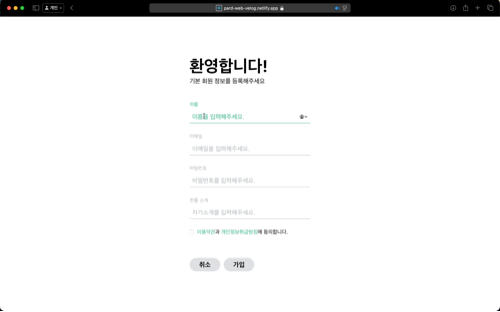
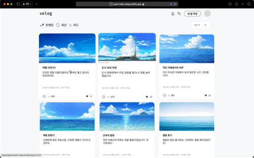
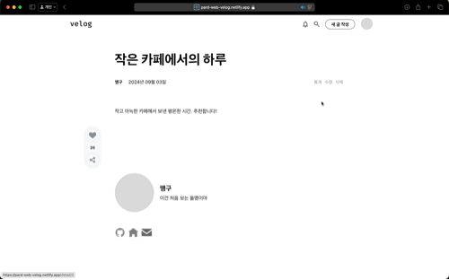
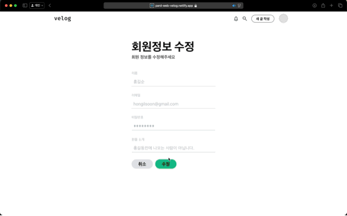

# 과제 : Velog 클론 코딩

## 개발 환경

- 라이브러리 : React
- 배포 : Netlify

## 사용 안내

1. 아래의 명령어를 터미널에 입력하여 repository를 다운 받는다.

```shell
git clone https://github.com/4th-PARD-WEB-PART/KimKwangil.git
```

2. 아래의 명령어를 터미널에 입력하여 해당 폴더로 이동한다.

```shell
cd pard_4th_kimkwangil_velog
```

3. 아래의 명령어를 터미널에 입력하여 package를 다운 받는다.

```shell
npm install
```

4. 아래의 명령어를 터미널에 입력하여 프로젝트를 실행한다.

```shell
npm start
```

## 과제 내용

### 1. 회원가입 페이지 만들기

- RegisterPage



### 2. 피드 리스트 페이지 만들기

- FeedPage



### 3. 피드 세부 페이지 만들기

- DetailPage



### 4. 회원정보 수정 페이지 만들기

- EditPage


